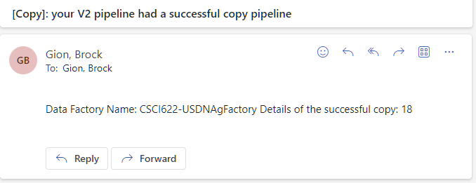
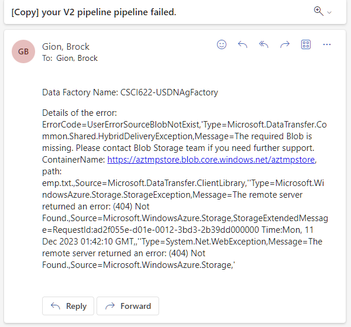
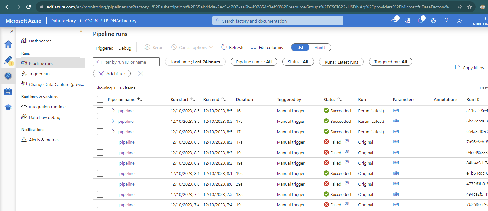

## Create blob table

storage account name:
aztmpstore

## Create email workflow endpoints

### Two workflow URLs:

#### Success email workflow
//Sucess Request URL
- https://triggeremailpipelinerun.azurewebsites.net:443/api/CopySucessEmail/triggers/When_a_HTTP_request_is_received/invoke?api-version=2022-05-01&sp=%2Ftriggers%2FWhen_a_HTTP_request_is_received%2Frun&sv=1.0&sig=FDWDF29-Zbi5F5f2kDRSH7gZEUpY-K-zfep5FF-xXtc

#### Fail email workflow
//Fail Request URL
- https://triggeremailpipelinerun.azurewebsites.net:443/api/CopyFailEmail/triggers/When_a_HTTP_request_is_received/invoke?api-version=2022-05-01&sp=%2Ftriggers%2FWhen_a_HTTP_request_is_received%2Frun&sv=1.0&sig=dQ-WL-pIKXu19tCNTithQu9uOLOZgjGekdltE92msO0

## Create a data factory

factory name:
CSCI622-USDNAg

## Create a pipeline

Pipeline Run Parameters at run-time
- sourceBlobContainer: adfv2branch
- sinkBlobContainer: adfv2branch
- receiver: youremail@gmail.com

## Trigger a pipeline run that succeeds

## Trigger a pipeline run that fails

## See complete pipeline run history

